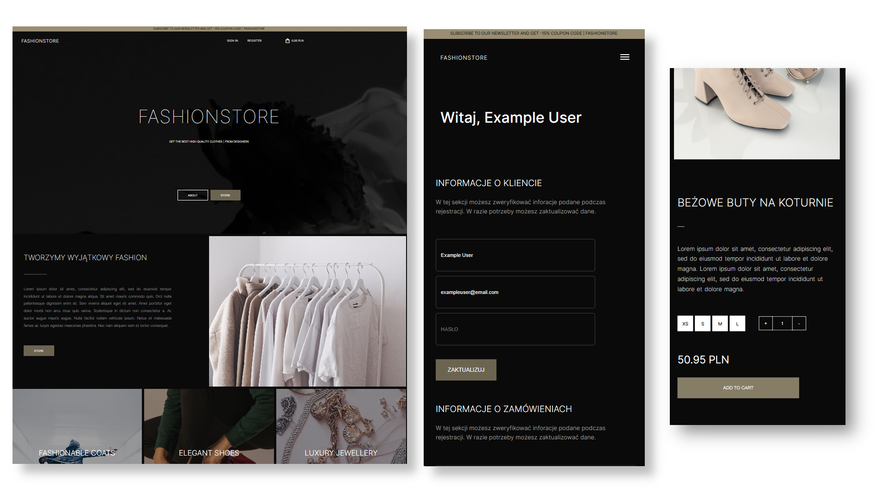

# Ecommerce-Webstore
Ecommerce MERN stack app with REDUX


## Features

- Responsywny nowoczesny design
- Możliwość rejestracji użytkownika - zapewnienie bezpieczeństwa dzięki wykorzystaniu JWT token oraz szyfrowania haseł przechowywanych w bazie danych
- W pełni funkcjonalny koszyk (zwiększanie / zmiejszanie ilości produktów w koszyku)
- Profil użytkownika - możliwość zmiany danych podaych podczas rejestracji
- Przedstawienie dokonanych transakcji na konie poszczególnych użytkowników
- Automatyczna kontrola ilości dostępnych produktów

## Install dependencies
 - Oprogramowanie korzysta z NodeJS. Upewnij się, że NodeJS jest zainstalowany na Twoim komputerze
 - Utwórz bazę danych MongoDB i zachowaj MongoDB URI (np. mongodb://localhost:27017 w przypadku instalacji lokalnej)

## .ENV FILES
Zmodyfikuj plik `example.envexample` w folderze `./backend` oraz `./backend/DBseeder` zmieniając nazwę na `.env`. Wprzypadku obu pliów uzupełnij danymi zmienne MONGO_URI,PORT,JWT_SECRET np.
```
MONGO_URI=mongodb://127.0.0.1:27017/fashionstore
PORT=5000
JWT_SECRET=abcd1234
```
